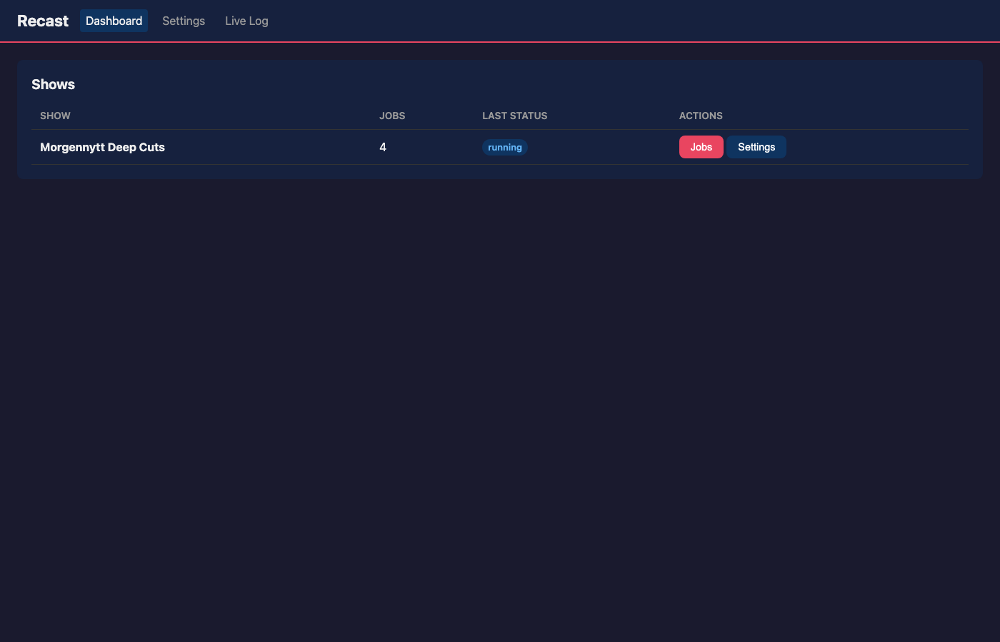
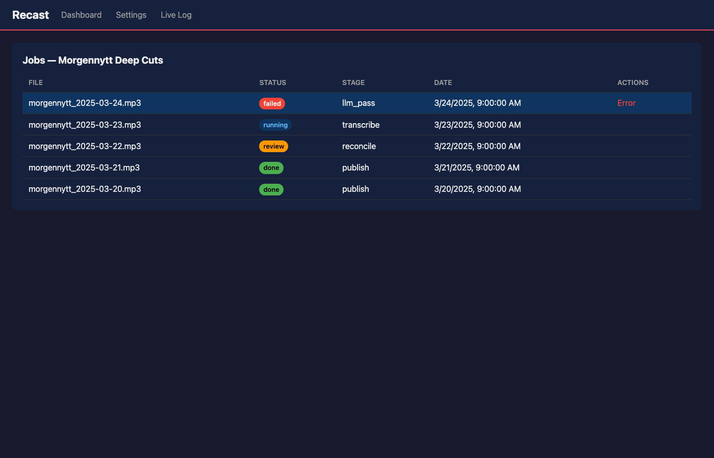
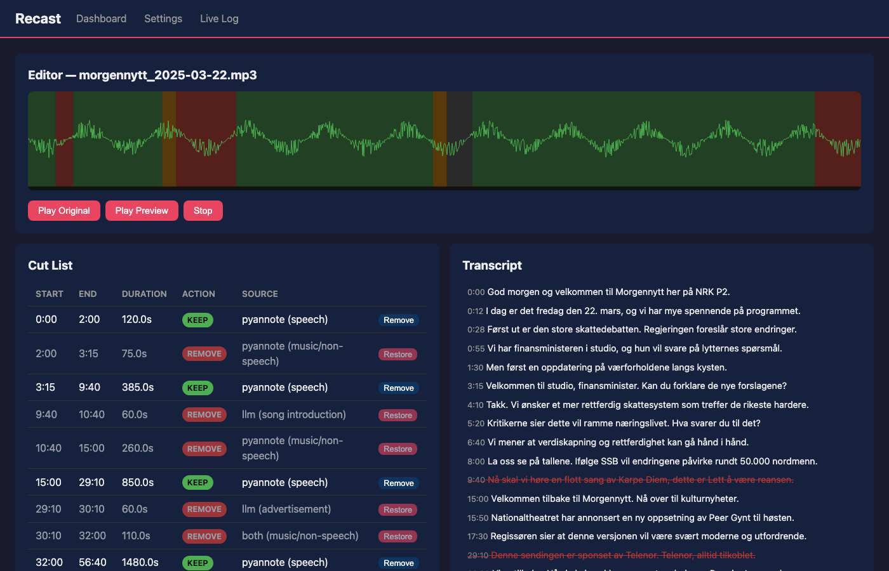
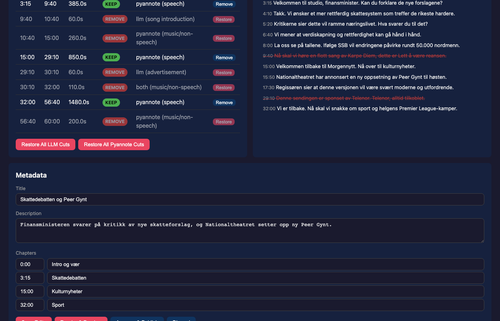
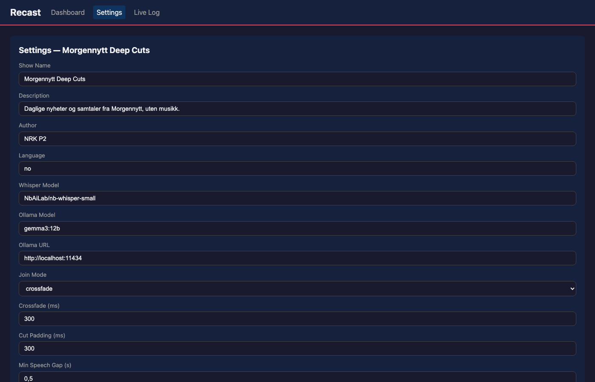
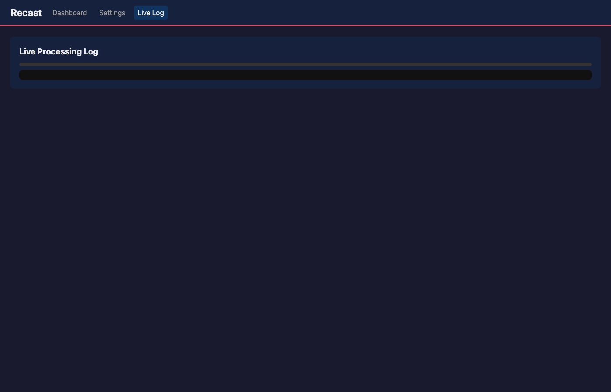

# Web UI Guide

Start the web UI with:

```bash
recast ui
```

Opens at http://localhost:8765 (use `--port` to change).

## Dashboard

The dashboard shows all configured shows with job counts, status, and quick actions.



- **Jobs** — opens the job list for the show
- **Settings** — opens the show configuration form
- Shows are auto-discovered from the `shows_dir` in `recast_config.toml`

## Job List

Click **Jobs** on a show to see all processing jobs.



| Status | Meaning |
|--------|---------|
| `queued` | Waiting to be processed |
| `running` | Pipeline currently running |
| `review` | Paused for human review (review mode enabled) |
| `done` | Completed successfully |
| `failed` | Error occurred (hover for details) |

Click any row to open the **Episode Editor**.

## Episode Editor

The core review interface for fine-tuning cut decisions before publishing.



### Waveform Panel

The top section shows a color-coded visualization of the audio:

| Color | Meaning |
|-------|---------|
| Green | Kept (speech) |
| Red | Removed (music, detected by pyannote) |
| Orange | Removed (spoken intro/outro, detected by LLM) |
| Grey | Removed (below minimum duration threshold) |

- **Hover** any region to see: start/end times, duration, reason, confidence score
- **Click** anywhere to seek the audio playhead
- **Play Original** — listen to the full uncut recording
- **Play Preview** — listen to the rendered episode with cuts applied

### Cut List Panel

A table of all cut decisions with actions:

- **Restore** — change a removed segment back to kept
- **Remove** — mark a kept segment for removal
- **Restore All LLM Cuts** — bulk-restore everything the LLM flagged
- **Restore All Pyannote Cuts** — bulk-restore everything pyannote flagged

### Transcript Panel

Full transcript with timestamps. Removed segments appear with strikethrough. Click any line to seek the audio to that position.

### Metadata Panel



Edit the generated episode metadata:

- **Title** — short descriptive title
- **Description** — 2-4 sentence summary
- **Chapters** — topic-based chapter markers with timestamps

### Actions Bar

| Action | Effect |
|--------|--------|
| **Save Edits** | Persist modified cut list (saves as `cutlist_user.json`) |
| **Render & Preview** | Re-render the episode with current cuts |
| **Approve & Publish** | Render final MP3, update RSS feed |
| **Discard** | Revert to pipeline-generated cut list |

## Show Settings

Edit all `show.toml` parameters via a form — no manual TOML editing required.



Available settings:

- Show metadata (name, description, author, language)
- Whisper model selection
- Ollama model and URL
- Join mode (crossfade / hard cut / silence)
- Cut padding, speech gap, minimum duration thresholds
- LLM confidence threshold
- Audio format and bitrate
- Publishing toggles (auto-publish, review mode)

Buttons at the bottom:

- **Test Ollama** — pings the configured endpoint, shows available models
- **Test ffmpeg** — verifies ffmpeg is on PATH

## Live Processing Log



Real-time pipeline progress when a job is running:

- Stage progress bar (Stage N of 8)
- Estimated time remaining (based on previous stage timing)
- Scrollable log of events

Connected via WebSocket — updates automatically without refreshing.

## Auto Mode vs Review Mode

### Auto Mode (default)

When `auto_publish = true` and `review_mode = false`:

1. File dropped in `incoming/`
2. Full pipeline runs automatically
3. Episode rendered and published
4. No human interaction needed

### Review Mode

When `review_mode = true`:

1. Pipeline runs through Stage 5 (reconcile)
2. **Pauses** — job appears as `review` status
3. Open the Episode Editor to review cuts
4. Click **Approve & Publish** when satisfied
